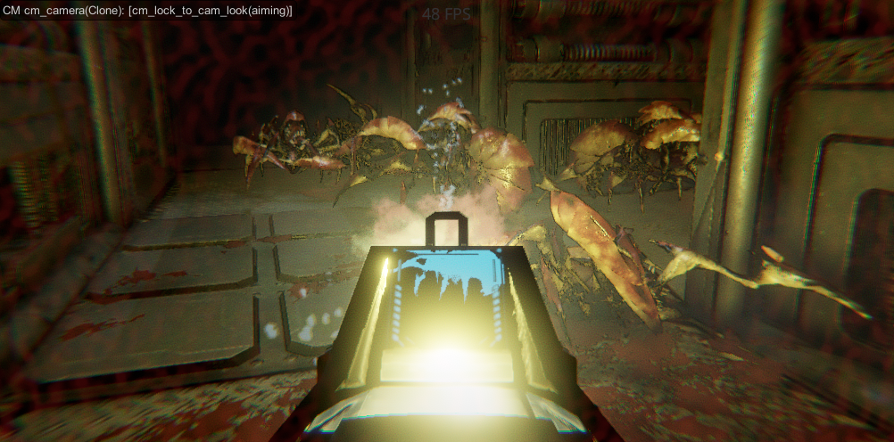
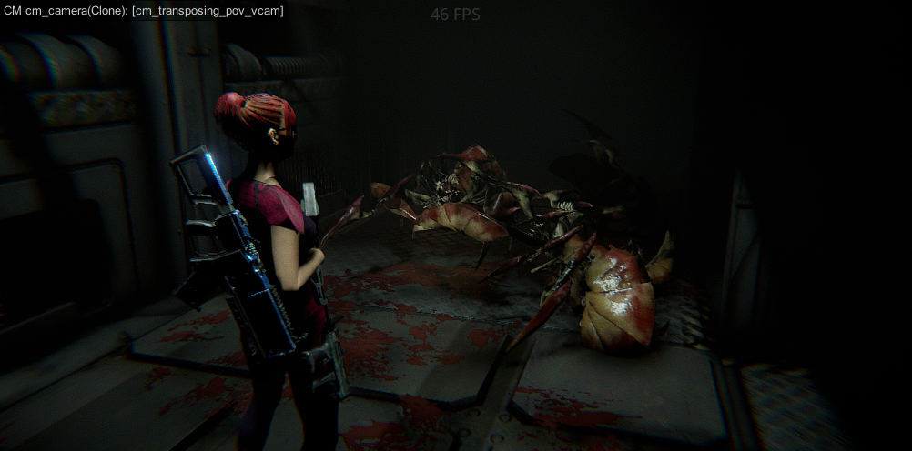

# Unity Game Developer / C# Programmer
Freelancer. About 8 years of using Unity. C# programming, 3D and 2D games development, multiplayer/singleplayer. Shooters, puzzles, etc. PC/Consoles preferrable.

# About Me
Experienced in programming for 20 years. First C++ then Java and C# finally (because of Unity). Love video games since chilhood. So at some point decided to dive into game development. Chose Unity engine, opened Angry Bots as a sample project (that was quite a long time ago). And that's how it started. Now I'm making video games and love it still.

# Skills
* C#
* Unity
* async/await (UniTask/Awaitable)
* RX (UniRx/R3)
* DI (Zenject/VContainer)
* Tweens (DOTween/PrimeTween)
* Multiplayer (Unity Services + Netcode for Game Objects)
* OOD, FP coding paradigms
* Recommended coding approaches like SOLID, KISS, DRY
* Design patterns (GoF, MVC/P, etc)
* Basics of Blender

# Projects

## Pimpochka Games projects

As a part of the team I was working on Mobile casual 2D/3D games

Technologies & tools:
* UniRx
* UniTask
* VContainer
* DOTweens
* Addressables

[See on App Store](https://play.google.com/store/apps/dev?id=5694854181182513422)

## Mecha Combat

[Mecha Combat](https://buggie-woogie.itch.io/mecha-combat) is a top-down multiplayer mecha shooter created initially for [MechJam4](https://itch.io/jam/mechjam4).

Technologies & tools:
* Zenject
* NGO
* UniTask

## Tetra4bica
[Tetra4bica](https://buggie-woogie.itch.io/tetra4bica) is a casual mobile game for your grandpa, who played Tetris being young

Technologies & tools:
* UniRx
* Zenject
* DOTween

## SquadBlast

[SquadBlast](www.google.com/url?q=https://store.steampowered.com/app/2080820/SquadBlast/&sa=D&source=editors&ust=1742649952498555&usg=AOvVaw0k2y2KwqbcDUffdztAGIZo) is a cross-platform multiplayer 2D shooter. As a part of a team I worked on it for about a year as a contractor

Technologies & tools:
* Photon Quantum Framework
* Functional Programming Style
* UniRx like library

## Rock N Smoke Racing

[Rock N Smoke Racing](https://buggie-woogie.itch.io/rock-n-smoke-racing) is a single player ‘Racing’ game created for some training course initially. It’s more like Carmageddon with no opponents.

Technologies & tools:
* Custom Car Physics
* UMA 2

## Codename: Space Lady

Semi-abandoned Third Person Sci-Fi pet project

Technologies & tools:
* UMA 2
* UniTask
* R3

<!---
north-star-fist/north-star-fist is a ✨ special ✨ repository because its `README.md` (this file) appears on your GitHub profile.
You can click the Preview link to take a look at your changes.
--->
